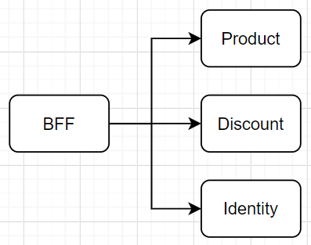
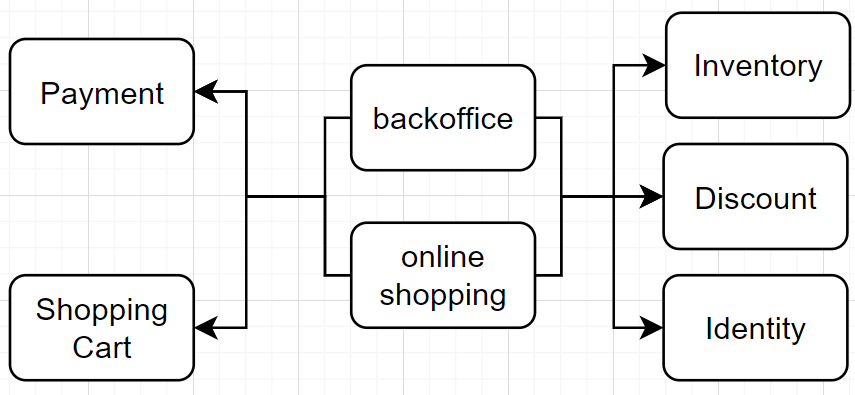
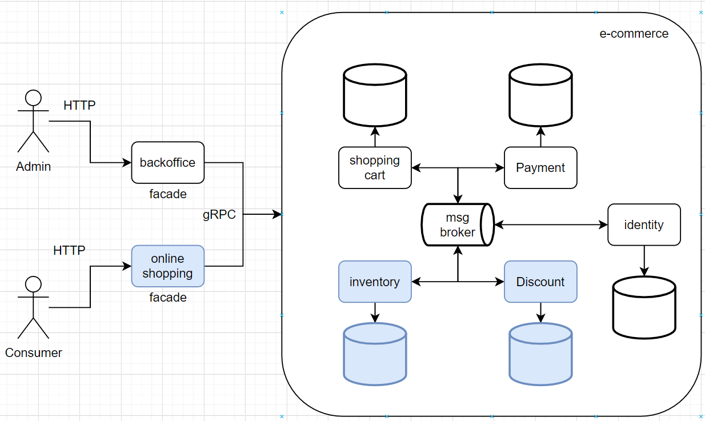

# e-commerce

## 1. Decisões

Antes de começar, fiz uma reflexão sobre as restrições do desafio e pensar numa 
arquitetura em cima delas.

> ## Restrictions
> * The services must be written in distinct programming languages.
> * The services must communicate via gRPC

O desafio em si é construir os serviços em linguagens diferentes e utilizando o 
protocolo gRPC pra comunicação entre eles. 

> ## Service 1: Discount calculator
> This service must receive two RPC arguments:
> * product_id: The ID of a Product
> * user_id: The ID of an User

O primeiro serviço deve ter uma função em que se receba o id do produto e o id do usuário, 
para então retornar o valor do desconto que será aplicado.

O cálculo do desconto utiliza a data de aniversário do usuário e a data do sistema para 
identificar se é BackFriday ou não. No cálculo a única informação do produto que é 
utilizada é o valor a qual será aplicado o desconto, porém é uma restrição do desafio 
receber o ID do produto, e não o valor.

Parece que esse serviço poderia ser agnóstico em relação ao produto, porque se ele deve 
conhecer o produto então teremos algumas implicações a nível de arquitetura. Então para que 
este serviço tenha conhecimento do produto é preciso que:

1. Este serviço é a fonte da verdade sobre o produto, e os serviços que dependem do 
   produto consultariam o serviço de desconto para obter informações sobre ele, ou
2. ele tem um acoplamento forte e acessa diretamente o serviço que tem as 
   informações do produto, ou
3. ele divide as informações do produto com outro serviço (compartilham o mesmo 
   banco de dados), ou
4. ele é dono apenas das informações necessárias para fazer o cálculo do produto. 
   (tem um banco de dados com informações sobre o produto que é utilizada no desconto,
   reduzindo o acoplamento com o serviço que será a fonte da verdade do produto)

O mesmo se aplica para o usuário. 

Antes de continuar é preciso entender as próximas restrições:

> ## Service 2: Products list
> This service exposes a HTTP endpoint GET /product that returns a list of products.
> 1. The endpoint response must be JSON encoded.
> 1. To calculate each product discount the service must consume service 1 via gRPC.
> 1. If service 1 errors while calculating a discount, the service must
     returns the product list but with zero discounts for the affected products.

Este serviço terá um endpoint para buscar todos os produtos, o que acaba levantando os
mesmo questionamentos que o primeiro serviço.

A primeira impressão desse serviço é que ele seria um BFF, onde ele traria as 
requisições formatadas para o front consumir. 

A imagem acima está considerando um contexto separado para o produto e desconto por causa
da terceira restrição desse serviço: Para calcular o desconto é preciso ter a lista
de produtos e para cada produto fazer a busca de desconto com base no usuário.

Um sistema que lide com usuários, produtos e descontos, talvez tenha que lidar com 
pagamentos e carrinhos de compras também, afinal estamos tratando de um ecommerce. 
Então uma possível iteração desse sistema pode ser adicionar esses conceitos, 
além de entender que produto está relacionado a estoque.

Após um pouco mais de análise, o que parecia ser um BFF está funcionando como 
um facade para o domínio, futuramente ele poderá implementar um padrão de 
orquestramento entre os serviços, principalmente entre pagamentos e estoque.
Além disso, pode ser vantajoso para o negócio separar as operações de backoffice 
(adicionar novo produto, aumentar quantidade de um produto no estoque, 
políticas de descontos, alteração de preços, criação de campanhas, promoções, etc.) 
das operações do shopping que o cliente pode fazer (buscar produtos, criar notificação 
para produto fora de estoque, adicionar produto no carrinho, fazer o pagamento dos 
produtos do carrinho, etc.)

Depois de contextualizar todo o sistema, é hora de escolher qual tipo de arquitetura
implementar.

O serviço 2 que será o facade para `online shopping` servirá apenas de orquestramento
entre os outros contextos. Ele será desenvolvido em node.js.

O serviço 1 é a grande dúvida. Ele pode ser divido entre 3 serviços (desconto, estoque e 
usuário) ou poderia ser um único serviço com esses 3 contextos sendo servidos em uma 
única porta, ou portas separadas para cada contexto. 

Antes de decidir, vamos analisar o contexto de desconto sob a ótica dos 4 questionamentos
anteriores.

> 1. Este serviço é a fonte da verdade sobre o produto, e os serviços que dependem do 
     produto consultariam o serviço de desconto para obter informações sobre ele

É indiscutível que o contexto de desconto não deva ser a fonte da verdade sobre os 
produtos.

> 2. ele tem um acoplamento forte e acessa diretamente o serviço que tem as
     informações do produto

O facade servirá para desacoplar os serviços. Além disso caso o contexto de desconto se 
comunicasse diretamente com o contexto de estoque, haveriam pelo menos 2 chamadas para ele.
A primeira seria no facade para pegar todos os produtos, e novamente no desconto para 
buscar cada produto.

> 3. ele divide as informações do produto com outro serviço (compartilham o mesmo
banco de dados)

Tratando de microserviços este é um ponto para ser evitado. Mesmo em um sistema 
monolito, seria melhor ter um acoplamento forte com o contexto de produto do que
ter acesso direto ao banco de dados de produto, ou criar um contexto que funcionasse
como facade para desacoplar os dois contextos. Ainda no monolito estariamos reduzindo as
quantidade de comunicação, poderiamos trazer os produtos e descontos com apenas um 
acesso ao banco. Como esse facade já está separado em um serviço, me parece que a solução
será em microserviços.

> 4. ele é dono apenas das informações necessárias para fazer o cálculo do produto.
     (tem um banco de dados com informações sobre o produto que é utilizada no desconto,
     reduzindo o acoplamento com o serviço que será a fonte da verdade do produto)

Como o sistema será desenvolvido utilizando microserviços esta será uma boa forma de
desacoplar os serviços, porém estamos abrindo mão da consistência e precisamos de 
mensageria para propagar os eventos do sistema. Cada microserviço ouvirá os eventos
que estão interessados. Caso um microserviço precise adicionar uma informação que ele não
ouvia, mas já era propagada pela mensageria ele deverá ouvir todos os eventos já propagados
desde o início.

Para este desafio não será abordado mensageria, pois não terá adição de produto, nem usuário.
Cada contexto terá um banco de dados próprio com as informações que ele irá utilizar.
Será criado apenas um serviço que irá conter os 2 contextos que estão em azul na imagem.
O contexto de usuário foi omitido, pois o foco principal está no contexto de desconto e este
armazerá as informações do usuário necessárias para seu funcionamento, id e data de nascimento,
assim como as informações do produto, id e preço. Este serviço será desenvolvido em GoLang.