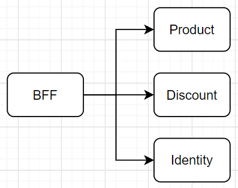
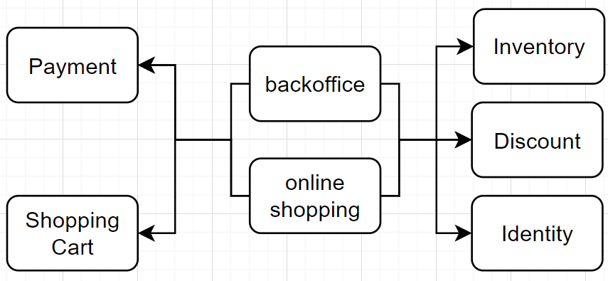
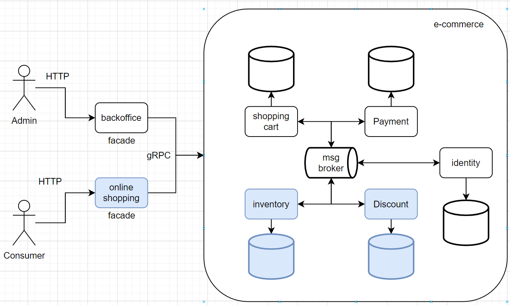

# e-commerce

## 1. Instalação

### 1.1 Dependências
* `sudo apt install build-essential`
* `docker v20.10.2` https://docs.docker.com/engine/install/
* `docker-compose v1.25.0` https://docs.docker.com/compose/install/
* `golang v1.16` https://golang.org/dl/

### 1.2 Testes
Esse repositório está dividido em 3 contextos principais `discount`, `inventory` e `online_shopping`, 
além das definições do protobuf `proto` e de teste de integração `ewallet-integration-test`.

Para rodar os testes do contexto `discount`
> `make test-discount`

Para rodar os testes do contexto `inventory`
> `make test-inventory` 

Para rodar os testes de integração `ewallet-integration-test`
> `make test-integration`

### 1.3 Rodando
> `make run`

Após executar o comando acima a api estará pronta pra aceitar conexões:

> `curl -H 'Api-Key: c5b6e72c-5b04-4bd2-ba5e-c85a253191dc' http://127.0.0.1:50054/products?userId=11054c65-89dd-46a6-86ab-c603195100a5`

### 1.4 Monitorando

Acesse o [Kibana](http://127.0.0.1:5601/app/apm) para visualizar o Application Performance Monitoring (APM).

### 1.5 Limpando

> `make clean`

## 2. Arquitetura e Design

O sistema foi desenvolvido utilizando micro-serviços com um banco de dados (Postgres) para cada serviço, 
como será discutido na sessão Decisões.

Cada serviço foi desenvolvido em cima de um [design em camadas](https://herbertograca.com/2017/11/16/explicit-architecture-01-ddd-hexagonal-onion-clean-cqrs-how-i-put-it-all-together/), 
utilizando empacotamento por componente. Além de seguir práticas como o [12factor](https://12factor.net/pt_br/).

## 3. Decisões

Antes de começar o desenvolvimento, fiz uma reflexão sobre as restrições do desafio e pensei numa 
arquitetura em cima delas.

> ## Restrictions
> * The services must be written in distinct programming languages.
> * The services must communicate via gRPC

O desafio é construir os serviços em linguagens diferentes, utilizando o 
protocolo gRPC como protocolo de comunicação entre eles. 

> ## Service 1: Discount calculator
> This service must receive two RPC arguments:
> * product_id: The ID of a Product
> * user_id: The ID of an User

O primeiro serviço deve ter uma função que receba o id do produto e o id do usuário como 
parâmetros e então retorne o valor do desconto que será aplicado.

O cálculo do desconto utiliza a data de aniversário do usuário e a data do sistema para 
identificar se é BackFriday. No cálculo, a única informação do produto utilizada é o valor 
que será aplicado o desconto, porém é uma restrição do desafio receber o ID do produto, 
e não o valor.

Esse serviço poderia ser agnóstico em relação ao produto e receber apenas o valor.
Mas ele deve conhecer o produto e por isso teremos algumas implicações a nível de arquitetura. 
Para isso é preciso que:

1. Este serviço seja a fonte da verdade sobre o produto, fazendo com que os serviços que dependem 
   do produto consultem este serviço para obter essas informações, ou
2. Este serviço tenha um acoplamento forte e acesse diretamente a fonte da verdade do produto, ou
3. Este serviço divida informações do produto com outro serviço (compartilham o mesmo 
   banco de dados), ou
4. Este serviço seja dono apenas das informações necessárias para calcular o desconto. 
   (tenha um banco de dados com as informações necessárias do produto 
   para aplicar o desconto, reduzindo o acoplamento com a fonte da verdade do produto)

Os mesmos questionamentos se aplicam para o usuário.

Antes de continuar é preciso entender as próximas restrições:

> ## Service 2: Products list
> This service exposes a HTTP endpoint GET /product that returns a list of products.
> 1. The endpoint response must be JSON encoded.
> 1. To calculate each product discount the service must consume service 1 via gRPC.
> 1. If service 1 errors while calculating a discount, the service must
     returns the product list but with zero discounts for the affected products.

Este serviço terá um endpoint para buscar todos os produtos. O que acaba levantando os
mesmo questionamentos que o primeiro serviço.

A primeira impressão desse serviço é que ele seria um BFF, onde ele traria as 
requisições formatadas para o front consumir. 

A imagem acima já está considerando um contexto separado para produto, desconto e usuário,
por causa da terceira restrição: `É preciso ter a lista de produtos e para cada produto 
buscar o desconto calculado.`

Um sistema que lide com usuários, produtos e descontos, talvez tenha que lidar com 
pagamentos e carrinhos de compras também, afinal estamos falando de um ecommerce. 
Uma possível iteração sobre o modelo do sistema seria adicionar esses conceitos.
Também devemos entender que produto está relacionado a estoque e que usuário se divide em
controle de acesso e identidade.

Após um pouco mais de análise, o que parecia ser um BFF está funcionando como 
um facade para o domínio. Futuramente ele poderá implementar um padrão de 
orquestramento entre os serviços, principalmente entre pagamentos e estoque.
Além disso, pode ser vantajoso para o negócio separar as operações de backoffice 
(adicionar novo produto, aumentar quantidade de um produto no estoque, 
políticas de descontos, alteração de preços, criação de campanhas, promoções, etc.) 
das operações de shopping que o cliente pode fazer (buscar produtos, criar notificação 
para produto fora de estoque, adicionar produto no carrinho, fazer o pagamento dos 
produtos do carrinho, etc.)

Depois de contextualizar todo o sistema, é hora de escolher que arquitetura implementar.

O serviço 2 será o facade `online-shopping` e funcionará como orquestramento
entre os outros contextos. Ele será desenvolvido em node.js.

O serviço 1 é a grande dúvida. Ele pode ser divido entre 3 serviços (desconto, estoque e 
identidade) ou poderia ser um único serviço com esses 3 contextos sendo servidos em uma 
única porta, ou portas separadas para cada contexto. 

Antes de decidir, vamos analisar o contexto de desconto sob a ótica dos 4 questionamentos
anteriores.

> 1. Este serviço seja a fonte da verdade sobre o produto, fazendo com que os serviços que dependem
     do produto consultem este serviço para obter essas informações

É indiscutível que o contexto de desconto não deve ser a fonte da verdade dos produtos.

> 2. Este serviço tenha um acoplamento forte e acesse diretamente a fonte da verdade do produto

Já existe um facade `online shopping` para desacoplar os serviços. Além disso caso o contexto de desconto se 
comunique diretamente com o contexto de estoque, haverá pelo menos 2 chamadas para este.
A primeira seria no facade para pegar todos os produtos, e novamente no desconto para 
buscar o valor de cada produto.

> 3. Este serviço divida informações do produto com outro serviço (compartilham o mesmo
     banco de dados)

Tratando de microserviços este é um ponto para ser evitado. Mesmo em um sistema 
monolítico, seria melhor ter um acoplamento forte com o contexto de produto do que
ter acesso direto ao banco de dados de produto. Outra opção ainda com monolito, seria criar um contexto 
que funcionasse como facade para desacoplar os outros dois contextos, reduzindo a
quantidade de comunicação total: trazer os produtos e descontos teria apenas um 
acesso ao banco. 

Como esse facade já está separado em um serviço `online shopping`, a solução
será com microserviços.

> 4. Este serviço seja dono apenas das informações necessárias para calcular o desconto.
     (tenha um banco de dados com as informações necessárias do produto
     para aplicar o desconto, reduzindo o acoplamento com a fonte da verdade do produto)

Esta será uma boa forma de desacoplar contextos entre serviços, porém estamos abrindo mão da consistência e precisamos de 
mensageria para propagar os eventos do sistema. Cada microserviço ouvirá os eventos
que estão interessados. Caso um microserviço precise adicionar uma informação que ele não
ouvia, mas já era propagada pela mensageria ele deverá ouvir todos os eventos já propagados
desde o início.

Para este desafio não será abordado mensageria, pois não terá função para adicionar produtos, nem usuários.
Cada contexto terá um banco de dados próprio apenas com as informações que ele utilizará.
Será criado apenas um repositório com os 3 contextos que estão em azul na imagem.
O contexto de identidade foi omitido, pois o foco principal está no contexto de desconto e este
armazerá as informações de identidade necessárias para seu funcionamento, id e data de nascimento,
assim como as informações do produto, id e preço. Estes serviços serão desenvolvidos em GoLang.